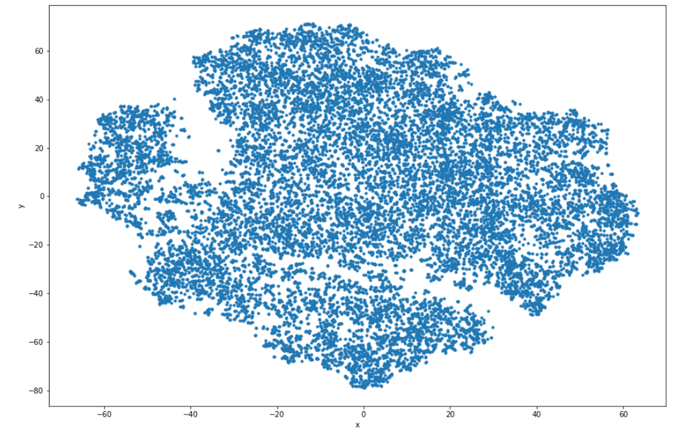

# Word2Vector

Using Word2Vec to explore semantic similarities between the entities of "Game of Thrones".We'll use them to the find the similarity between words, map them out in 2D space, and analyze them.

```
In[]  : nearest_similarity("Stark", "Winterfell", "Riverrun")

Out[] : Stark is related to Winterfell, as Prince is related to Riverrun
       'Prince'
```
# Plot
